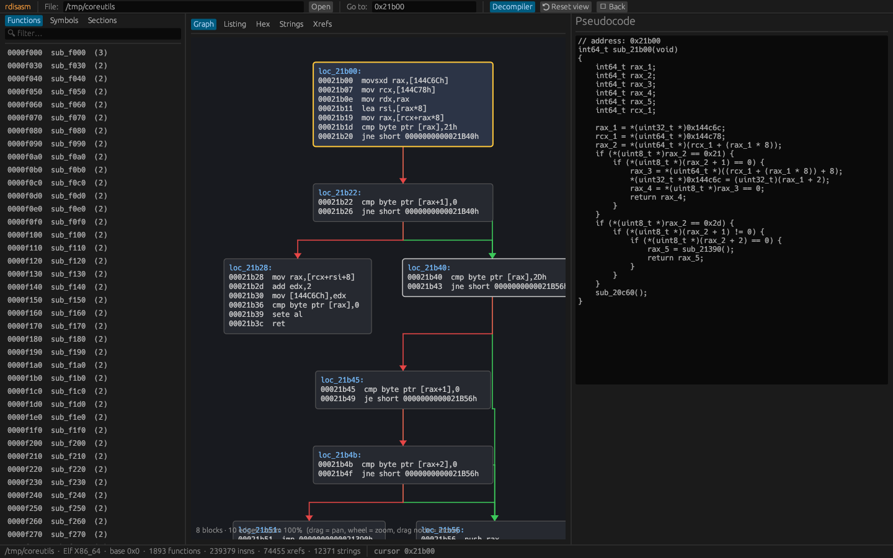

# rdisasm — Rust Disassembler & Decompiler

[](https://github.com/malganis13/rust-disasm/actions/workflows/ci.yml)
[](https://github.com/malganis13/rust-disasm/releases)


A fast binary disassembly and decompilation engine written in **100 % safe Rust**, inspired by IDA Pro, Binary Ninja and Ghidra.

* Loads **PE, ELF and Mach-O** (including fat binaries) into a single virtual memory map
* **Recursive-descent x86 / x86-64 disassembler** (`iced-x86`), with jump-table recovery, non-returning-function analysis and prologue scanning
* **Control-flow graphs** (`petgraph`), dominators, loop back-edges, cyclomatic complexity and DOT export
* **Lock-free cross-references** (`dashmap`): code→code, code→data, data→code
* **Decompiler**: SSA IR → constant folding / copy propagation / DCE → `if`/`else`/`while`/`do-while`/`switch` structuring → type and signature inference → C pseudocode
* **GUI** (`egui`): interactive CFG with draggable nodes, pan and zoom, and colour-coded edges; hex view; function, symbol and string lists; xrefs; side-by-side pseudocode
* **Headless CLI** for batch analysis and JSON / CSV / C export
* **Rhai plugin scripting** API
* **Data-parallel** analysis with `rayon`



---

## Performance

Measured on a 2-vCPU sandbox (release build), analysing `/usr/bin/coreutils` (1.3 MB, x86-64 PIE, stripped):

| Metric | Value |
|---|---|
| Full analysis: load, disassembly, CFGs, xrefs, strings | **≈ 0.5 s** |
| Functions recovered | 1,893 |
| Instructions decoded | 239,379 |
| Cross-references | 74,455 |
| Decompile **all** functions to C | ≈ 2 s |

---

## Installation

### Pre-built binaries

Download the archive for your platform from the [**Releases**](https://github.com/malganis13/rust-disasm/releases) page. Each archive contains:

* `rdisasm`: CLI
* `rdisasm-gui`: desktop app
* `examples/`: Rhai plugin scripts

### From source

```bash
git clone https://github.com/malganis13/rust-disasm
cd rust-disasm
cargo build --release
# binaries: target/release/rdisasm  target/release/rdisasm-gui
```

Requires Rust ≥ 1.80. On Linux the GUI needs X11 or Wayland and OpenGL at runtime (`libX11`, `libxkbcommon` and `libGL`, which are standard on desktop distros).

---

## Usage

### CLI

```text
rdisasm info       <file>                    headers, sections, entry points, stats
rdisasm functions  <file> [-f filter]        list functions (size, insns, blocks, complexity)
rdisasm disasm     <file> [addr|name]        disassemble a function (default: entry)
rdisasm decompile  <file> [addr|name]        C pseudocode for one function
rdisasm decompile  <file> --all              … for every function (parallel)
rdisasm cfg        <file> [addr|name]        Graphviz DOT of the CFG
rdisasm xrefs      <file> <addr|name>        references to an address
rdisasm strings    <file> [-n 4]             ASCII + UTF-16LE strings
rdisasm export     <file> -f json|csv|c [-o out]
rdisasm script     <file> <script.rhai>      run a Rhai plugin
```

Add `-v` / `-vv` for tracing output.

```bash
$ rdisasm decompile /usr/bin/coreutils 0x21b00
// address: 0x21b00
int64_t sub_21b00(void)
{
    ...
    rax_2 = *(uint64_t *)(rcx_1 + (rax_1 * 8));
    if (*(uint8_t *)rax_2 == 0x21) {
        if (*(uint8_t *)(rax_2 + 1) == 0) {
            rax_3 = *(uint64_t *)((rcx_1 + (rax_1 * 8)) + 8);
            *(uint32_t *)0x144c6c = (uint32_t)(rax_1 + 2);
            rax_4 = *(uint8_t *)rax_3 == 0;
            return rax_4;
        }
    }
    if (*(uint8_t *)rax_2 == 0x2d) {
        ...
    }
    sub_20c60();
}

$ rdisasm cfg ./a.out main | dot -Tsvg > main.svg
```

### GUI

```bash
rdisasm-gui [binary] [address|name]
```

| Action | How |
|---|---|
| Open binary | Path field, CLI argument, or **drag & drop** |
| Navigate | Click a function / symbol, **Go to** box (`0x…` or name), double-click a call in Listing |
| Back | `Esc` or **← Back** |
| Graph | Drag background to pan, mouse wheel to zoom (around the cursor), drag nodes to move them |
| Edge colours | 🟩 True (taken) · 🟥 False (fall-through) · 🟦 Unconditional · 🟪 Switch · ⬜ Fall-through |
| Views | Graph · Listing · Hex (synced with the cursor) · Strings · Xrefs · Pseudocode panel |

### Rhai plugins

Scripts receive a global `bin` object:

| API | Returns |
|---|---|
| `bin.format`, `bin.arch`, `bin.entry`, `bin.image_base` | properties |
| `bin.functions()` | array of `#{entry, name, blocks, edges, insns, size, complexity, calls}` |
| `bin.strings()` | array of `#{addr, value}` |
| `bin.xrefs_to(a)` / `bin.xrefs_from(a)` | array of `#{from, to, kind}` |
| `bin.disasm(a)` | array of instruction strings |
| `bin.decompile(a)` | C pseudocode string |
| `bin.read_bytes(a, n)` | blob |
| `bin.symbol(a)` | name or `()` |
| `hex(n)` | `"0x…"` |

```rhai
// examples/hotspots.rhai
let funcs = bin.functions();
funcs.sort(|a, b| b.complexity - a.complexity);
for f in funcs.extract(0, 10) {
    print(`${hex(f.entry)}  cc=${f.complexity}  ${f.name}`);
}
```

Scripts run in a sandbox with operation and recursion limits.

### As a library

```rust
use disasm_core::{analysis::Analysis, loader::Binary};

let bin = Binary::from_path("a.out")?;
let analysis = Analysis::run(&bin);            // parallel
for f in analysis.functions() {
    println!("{:#x} {} ({} blocks)", f.entry, f.name, f.cfg.block_count());
    let c = decompiler::decompile(f, bin.arch)?;
}
for x in analysis.xrefs.refs_to(0x401000) { /* … */ }
```

---

## Architecture

```text
crates/
├── disasm-core/        # Phase 1–2
│   ├── loader.rs       # PE / ELF / Mach-O → MemoryMap, symbols, entry points, PDB/DWARF detection
│   ├── disasm.rs       # iced-x86 linear sweep + recursive descent, jump tables, mem-refs
│   ├── cfg.rs          # basic blocks, petgraph DiGraph, dominators, back edges, DOT
│   ├── xref.rs         # DashMap bidirectional xref DB
│   ├── strings.rs      # parallel ASCII / UTF-16 scanner
│   └── analysis.rs     # driver: parallel discovery, noreturn fixpoint, PLT naming, data-in-code
├── decompiler/         # Phase 3
│   ├── ir.rs           # three-address SSA IR, dominators (Cooper-Harvey-Kennedy)
│   ├── lift.rs         # x86 → IR
│   ├── ssa.rs          # φ placement (dominance frontiers), renaming, φ lowering
│   ├── passes.rs       # constant folding, copy/expression propagation, DCE
│   ├── structure.rs    # loops / if-else / switch recovery, tail duplication, goto fallback
│   ├── types.rs        # local types, parameter and return inference (SysV ABI)
│   └── emit.rs         # C pretty-printer
├── gui/                # Phase 4 (egui / eframe)
└── cli/                # Phase 5 (clap, Rhai plugins, JSON / CSV / C export)
```

### Analysis pipeline

1. **Load**: goblin parses the container. Sections, or `PT_LOAD` segments for section-less ELF, are mapped with their permissions. Symbols, exports, imports and GOT slots are collected.
2. **Seed**: entry points, exported and symbol functions.
3. **Discover** (parallel rounds): each frontier function is explored by recursive descent. Calls feed the next round, and jumps to known entries become tail calls.
4. **Jump tables**: absolute (`jmp [tbl+idx*8]`) and relative (`lea; movsxd; add; jmp reg`) tables. The table size comes from the dominating `cmp idx, N; ja` bound.
5. **Noreturn fixpoint**: known noreturn imports (`exit`, `abort`, `__stack_chk_fail`, …) and derived noreturn functions. Callers are re-explored so code after the call is not merged.
6. **Prologue scan**: finds functions in the gaps that are only reached indirectly.
7. **Xrefs and data-to-code pointer scan** (parallel); **data-in-code** regions are the exec-section bytes not reached by any path.

---

## Limitations and roadmap

* The decompiler targets readability rather than recompilable output. Flag modelling is simplified (`cmp`/`test` + `jcc`/`setcc`), and FPU / SIMD instructions are kept as `__asm__`.
* Calling-convention inference assumes SysV x64 argument registers.
* PDB / DWARF are detected but not parsed yet.
* ARM64 binaries load (sections, symbols, strings), but disassembly is x86-only for now. `bad64` support is planned.
* Planned: Python bindings (`pyo3`), saving and loading project databases, user renaming and comments, an ARM64 lifter.

## Testing

```bash
cargo test --workspace     # unit and end-to-end tests (including a self-analysis of the test binary)
cargo clippy --workspace --all-targets -- -D warnings
```

## License

MIT, see [LICENSE](LICENSE).
